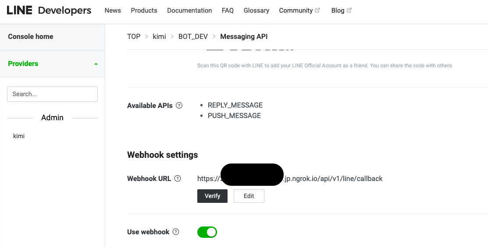

# linebot-go
Sample LineBot. receive message from line webhook, save the user info and message in MongoDB.

Use below golang libs:
* HTTP framework: https://github.com/gin-gonic/gin
* Config: https://github.com/spf13/viper
* Mongo driver: https://github.com/mongodb/mongo-go-driver 
* cobra: command line tools https://github.com/spf13/cobra
* Go line sdk : https://github.com/line/line-bot-sdk-go

## Demo

First, you should setup necessary config of LINE, MongoDB, etc in `config.toml` and `local.toml`.
If you wan't your config push to repository, copy `local.example.toml` to `local.toml`.

[API Doc Links](#apis)

### 1. Start Service
#### If Run `go run main.go`
`config=<your config file name. ex:config.toml or local.toml>`

example:
```sh
make run-local config=config.toml
```

#### If Run bin file
`config=<your config file name. ex:config.toml or local.toml>`

example:
```sh
make clean
make build
make run config=config.toml
```

### 2. Set Line Webhook

1. Go to [LINE Developers Console](https://developers.line.biz/en/)
2. Add ngrok url to `Webhook URL`

```sh
# <ngrok url>/api/v1/line/callback
https://835d-61-228-16-110.jp.ngrok.io/api/v1/line/callback
```



---
## APIs
### 1. Get User List
#### HTTP Request
`GET {{URL}}/api/v1/users?limit=10&keyword=KK&order=desc&by=updated_at&page=1`

```shell
curl --location --request GET 'http://127.0.0.1:8080/api/v1/users?limit=10&keyword=KK&order=desc&by=updated_at&page=1'
```

| Parameter | type   | Description                              | default |
|-----------|--------|------------------------------------------|---------|
| limit     | int    | (optional) The number of items per page  | 100     |
| page      | int    | (optional) The index of the current page | 1       |
| order     | string | (optional) desc / asc                    | desc    |
| by        | string | (optional) order field                   | id      |
| keyword   | string | (optional) search displayName            |         |

#### HTTP Response

```json
[
    {
        "_id": "6417e76a71b3ed9dec533ca6",
        "userId": "5566",
        "displayName": "KK",
        "pictureUrl": "123456",
        "statusMessage": "status message",
        "language": "en",
        "created_at": "2023-03-20T04:56:10.567Z",
        "updated_at": "2023-03-20T04:56:10.567Z"
    }
    ...
]
```

| Parameter     | type   | Description                   |
|---------------|--------|-------------------------------|
| _id           | string |                               |
| userId        | string | user id from LINE             |
| displayName   | string | user name from LINE           |
| pictureUrl    | string | user picture from LINE        |
| statusMessage | string | user status message from LINE |
| language      | string | user language from LINE       |

#### HTTP Response Headers
| Header        | Description                   |
|---------------|-------------------------------|
| X-Page        | The index of the current page |
| X-Per-Page    | The number of items per page  |
| x-total       | The total number of items     |
| x-total-pages | The total number of pages     |

### 2. Get Message List
#### HTTP Request
`GET {{URL}}/api/v1/messages?limit=10&order=desc&by=updated_at&page=1&userId=5566`

```shell
curl --location --request GET 'http://127.0.0.1:8080/api/v1/messages?limit=10&order=desc&by=updated_at&page=1&userId=5566'
```

| Parameter | type   | Description                              | default |
|-----------|--------|------------------------------------------|---------|
| userId    | string | (optional) LINE User id                  |         |
| limit     | int    | (optional) The number of items per page  | 100     |
| page      | int    | (optional) The index of the current page | 1       |
| order     | string | (optional) desc / asc                    | desc    |
| by        | string | (optional) order field                   | id      |
| keyword   | string | (optional) search displayName            |         |

#### HTTP Response

```json
[
    {
        "_id": "64180e9ed08678d19571a8a7",
        "type": "message",
        "userId": "5566",
        "replyToken": "123456789",
        "messageId": "message id",
        "messageText": "Hello World, Kimi",
        "timestamp": "2023-03-20T07:43:26.445Z",
        "created_at": "2023-03-20T07:43:26.533Z",
        "updated_at": "2023-03-20T07:43:26.533Z"
    }
    ...
]
```

| Parameter   | type      | Description            |
|-------------|-----------|------------------------|
| _id         | string    |                        |
| type        | string    | LINE event type        |
| userId      | string    | user id from LINE      |
| replyToken  | string    | replyToken from LINE   |
| messageId   | string    | message id from LINE   |
| messageText | string    | message text from LINE |
| timestamp   | time.time | timestamp from LINE    |


#### HTTP Response Headers
| Header        | Description                   |
|---------------|-------------------------------|
| X-Page        | The index of the current page |
| X-Per-Page    | The number of items per page  |
| X-total       | The total number of items     |
| X-total-pages | The total number of pages     |


### 3. LINE Push Message
#### HTTP Request
`POST {{URL}}/api/v1/line/message/push`

```shell
curl --location --request POST 'http://127.0.0.1:8080/api/v1/line/message/push' \
--form 'userId="user id"' \
--form 'message="Hello"'
```

| Parameter | type   | Description                     | default |
|-----------|--------|---------------------------------|---------|
| userId    | string | (required) LINE User id         |         |
| message   | string | (required) Message want to sent |         |

#### HTTP Response

```json
{
    "message": "ok"
}
```

---
## Ngrok
Download : https://dashboard.ngrok.com/get-started/setup

Connect your account : `ngrok config add-authtoken <your auth>`

Run `./ngrok http <port>`

```sh
./ngrok http 8080
```

## Run locally
### Using Docker
```sh
docker-compose up --build

docker-compose start

docker-compose stop
```

### Using Command
```sh
# command 
# go run main.go --config <your config> http --port <your port>
go run main.go --config config.toml http --port 8080

# Executed file
./build/linebot-go.mac.x64 --config config.toml http --port 8080

# air -c  <your air config> --port <your port>
# Note!!! run default file local.toml
air -c air.toml http
```

### Test Http Server

```sh
curl 127.0.0.1:8080/ping
```

---
##  Mongodb Configuration
* Root Username = root
* Root Password = root
* User Username = user
* User Password = user_password
* Database = linebot-go
* IP = 127.0.0.1
* Port = 27017

# Reference
* [developers.line.biz](https://developers.line.biz/en/docs/)
* [使用 Docker 構築不同 MongoDB 架構 (二) - Standalone](https://ithelp.ithome.com.tw/articles/10224871)
* [使用Docker建立Mongodb加上Mongo Express](https://104.es/2022/07/05/docker-compose-mongodb-mongo-express/)
* [How to create a DB for MongoDB container on start up?](https://stackoverflow.com/questions/42912755/how-to-create-a-db-for-mongodb-container-on-start-up)
* [mongodb : db.getSiblingDB()](https://www.mongodb.com/docs/manual/reference/method/db.getSiblingDB/)
* [MONGO_INITDB_DATABASE and directory docker-entrypoint-initdb.d not running](https://github.com/docker-library/mongo/issues/429)
* [Docker Compose MongoDB docker-entrypoint-initdb.d is not working](https://stackoverflow.com/questions/60522471/docker-compose-mongodb-docker-entrypoint-initdb-d-is-not-working)
* [config: spf13/viper](https://github.com/spf13/viper)
* [cosmtrek/air](https://github.com/cosmtrek/air)
* [mongodb Connection Guide](https://www.mongodb.com/docs/drivers/go/current/fundamentals/connection/)